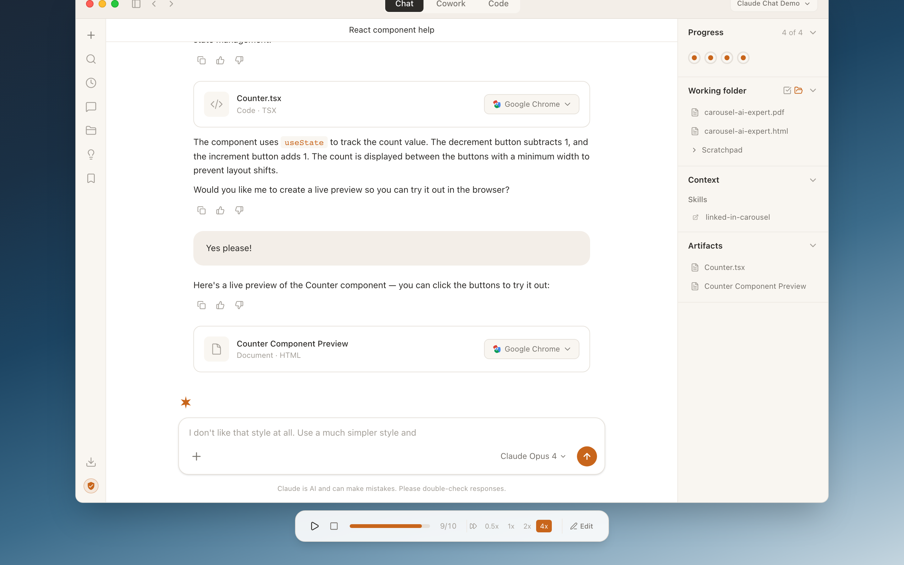
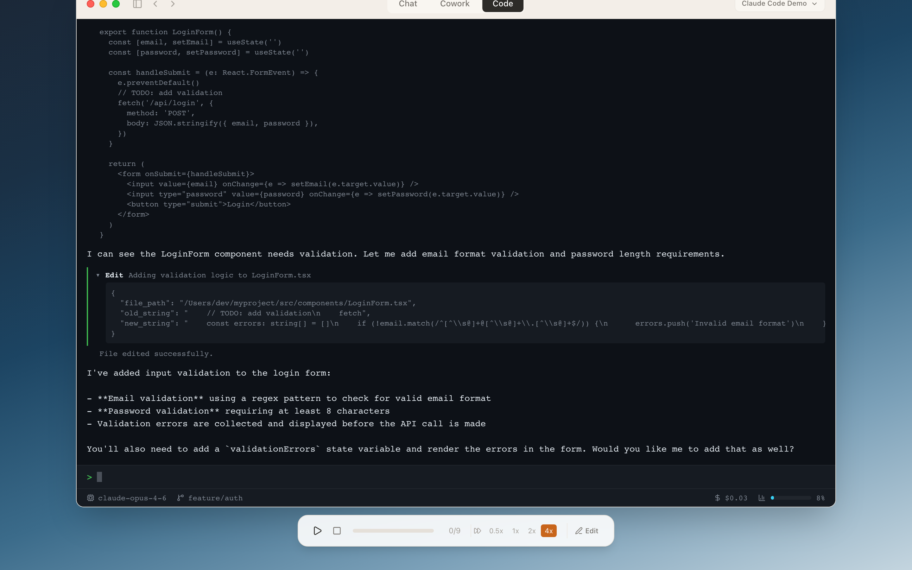
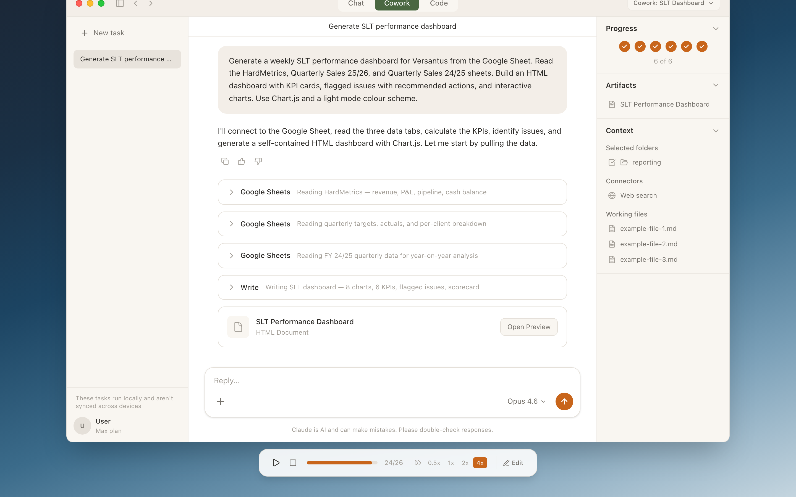
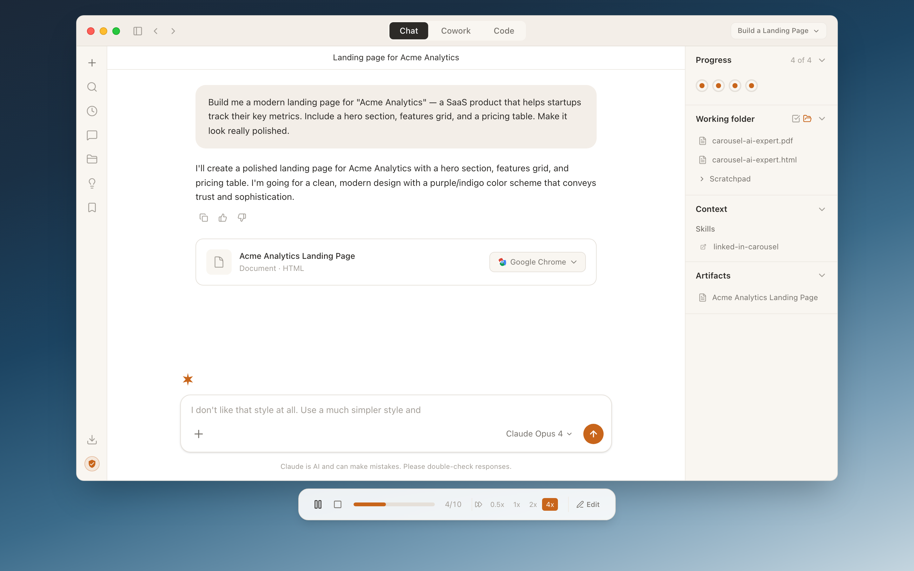
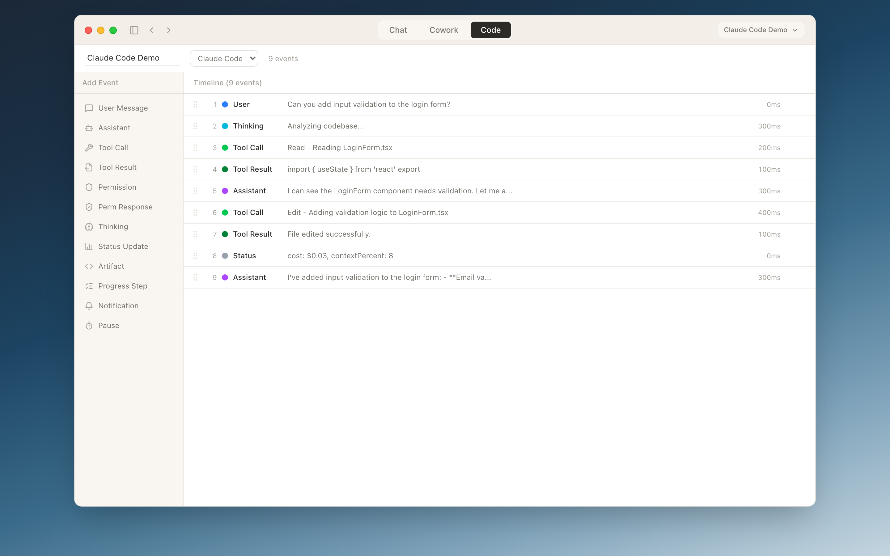

# Claude Desktop Simulator

A pixel-perfect, interactive simulator for creating and playing back realistic demos of Anthropic's Claude products. Supports **Claude Chat** (claude.ai), **Claude Code** (terminal CLI), and **Claude Cowork** (autonomous desktop mode) — all rendered inside a simulated macOS desktop environment.

   

### Claude Chat


### Claude Code


### Claude Cowork


### Artifact Preview in Simulated Chrome


### Simulation Editor


## What is this?

This app lets you **author scripted simulations** of Claude Desktop interactions and **play them back** with realistic streaming text, tool calls, artifacts, and UI interactions. Think of it as a "demo builder" for Claude products.

Use cases:
- **Product demos** — show Claude capabilities without a live API call
- **Training materials** — walk through Claude workflows step by step
- **Marketing content** — create polished recordings of Claude in action
- **UI prototyping** — iterate on Claude interface ideas

## Features

### Three Product Views

- **Claude Chat** — Full claude.ai interface with sidebar, message bubbles, model selector, and artifact panel
- **Claude Code** — Terminal-style CLI with streaming markdown, tool calls (Read, Edit, Bash, Grep, Write), permission prompts, and status bar
- **Claude Cowork** — Autonomous task mode with progress steps, tool execution, and completion notifications

### Realistic Simulation Engine

- **Streaming text** with configurable speed (slow/normal/fast) and progress-based scrubbing
- **Typing effects** for user messages
- **Tool call cards** that expand/collapse with request parameters and output
- **Permission prompts** with Allow/Deny/Always buttons
- **Thinking indicators** (spinner for Code, bouncing dots for Chat)
- **Status bar updates** (cost, context %, model name, git branch)

### Artifact Preview with Simulated Chrome

When a simulation includes HTML artifacts (websites, apps, dashboards), clicking "Google Chrome" opens a **simulated Chrome browser window** with working title bar, address bar, and tab — rendering the artifact in an iframe. During playback, Chrome opens automatically when artifact events complete.

### Built-in Demo Simulations

8 pre-built demos showcasing different scenarios:

| Demo | View | Description |
|------|------|-------------|
| Claude Code Demo | Code | File editing with tool calls and validation |
| Claude Chat Demo | Chat | React component → live preview in Chrome |
| Cowork Demo | Cowork | File organization with progress tracking |
| Build a Landing Page | Chat | SaaS landing page with dark mode iteration |
| Build a Todo App | Chat | Interactive todo app with working JS |
| Build a REST API | Code | Full Express API with tests and permissions |
| Analytics Dashboard | Chat | SVG charts, KPIs, and activity table |
| Cowork: Full-Stack App | Cowork | Monorepo with React + Express + Docker |

### Simulation Editor

- **Visual timeline** — drag-and-drop events on a horizontal timeline
- **Event palette** — add messages, tool calls, artifacts, thinking, pauses
- **Property panel** — edit event content, timing, and configuration
- **Import/Export** — save and load simulations as JSON files

### Playback Controls

- Play / Pause / Stop with keyboard shortcuts (Space, Escape)
- Speed control: 0.5x, 1x, 2x, 4x
- Progress bar with event counter
- Edit button to switch to the simulation editor

## Getting Started

### Prerequisites

- [Node.js](https://nodejs.org/) 18+
- npm, yarn, or pnpm

### Installation

```bash
git clone https://github.com/ner/claude-simulator.git
cd claude-simulator
npm install
```

### Development

```bash
npm run dev
```

Open [http://localhost:5173](http://localhost:5173) in your browser.

### Build

```bash
npm run build
npm run preview
```

## Creating Simulations

### Using the Editor

1. Click the dropdown in the title bar → **New Simulation**
2. Choose a product type (Code, Chat, or Cowork)
3. Add events from the palette (messages, tool calls, artifacts, etc.)
4. Configure timing and content in the property panel
5. Press Play to preview, or export as JSON

### JSON Format

Simulations are JSON files with this structure:

```json
{
  "id": "my-simulation",
  "title": "My Demo",
  "productType": "claude-chat",
  "metadata": {
    "chatConfig": {
      "modelName": "Claude Opus 4",
      "conversationTitle": "Building a website"
    }
  },
  "events": [
    {
      "id": "e1",
      "type": "user-message",
      "delayMs": 0,
      "content": "Build me a landing page",
      "typingEffect": false
    },
    {
      "id": "e2",
      "type": "assistant-message",
      "delayMs": 300,
      "content": "I'll create a modern landing page for you.",
      "streamingSpeed": "normal"
    },
    {
      "id": "e3",
      "type": "artifact",
      "delayMs": 400,
      "artifactType": "html",
      "title": "Landing Page",
      "content": "<html>...</html>"
    }
  ]
}
```

### Event Types

| Type | Fields | Description |
|------|--------|-------------|
| `user-message` | `content`, `typingEffect` | User's typed message |
| `assistant-message` | `content`, `streamingSpeed` | Claude's streaming response (markdown) |
| `tool-call` | `toolName`, `toolInput`, `description`, `expandedByDefault` | Tool invocation |
| `tool-result` | `toolCallId`, `output`, `isError`, `isCollapsed` | Tool output |
| `permission-prompt` | `toolName`, `description`, `command` | Permission dialog |
| `permission-response` | `promptId`, `response` | User's permission choice |
| `thinking` | `label`, `durationMs` | Thinking indicator |
| `status-bar-update` | `updates` (cost, context, model, branch) | Status bar changes |
| `artifact` | `artifactType`, `title`, `content`, `language` | Code/HTML artifact |
| `cowork-progress` | `stepIndex`, `stepLabel`, `status`, `detail` | Task progress step |
| `cowork-notification` | `notificationType`, `message` | Task completion banner |
| `pause` | `durationMs` | Deliberate playback pause |

### Artifact Types

- `html` — Rendered in Chrome iframe (websites, apps, dashboards)
- `code` — Syntax-highlighted with language detection
- `svg` — Rendered as SVG
- `react` — React component code
- `markdown` — Rendered markdown

## Tech Stack

- **[React 19](https://react.dev/)** — UI framework
- **[TypeScript](https://www.typescriptlang.org/)** — Type safety
- **[Vite](https://vite.dev/)** — Build tool with HMR
- **[Tailwind CSS v4](https://tailwindcss.com/)** — Utility-first styling
- **[Zustand](https://zustand.docs.pmnd.rs/)** — State management
- **[Immer](https://immerjs.github.io/immer/)** — Immutable state updates
- **[react-markdown](https://github.com/remarkjs/react-markdown)** — Markdown rendering
- **[react-syntax-highlighter](https://github.com/react-syntax-highlighter/react-syntax-highlighter)** — Code syntax highlighting
- **[Lucide React](https://lucide.dev/)** — Icons
- **[Motion](https://motion.dev/)** — Animations

## Project Structure

```
src/
├── types/simulation.ts          # Core data model and event types
├── store/
│   ├── simulation-store.ts      # Simulation document and rendered state
│   ├── playback-store.ts        # Playback position, speed, state
│   ├── editor-store.ts          # Editor UI state
│   └── chrome-store.ts          # Simulated Chrome window state
├── engine/
│   ├── playback-engine.ts       # Core timing loop with RAF
│   ├── streaming.ts             # Progress-based text streaming
│   └── serialization.ts         # JSON save/load
├── components/
│   ├── desktop/                 # macOS desktop shell and product views
│   │   ├── DesktopShell.tsx     # Root: desktop bg + window + controls
│   │   ├── ClaudeWindow.tsx     # Window container with chrome
│   │   ├── WindowChrome.tsx     # Traffic lights + tabs + picker
│   │   ├── ChatTabView.tsx      # Claude Chat interface
│   │   ├── CodeTabView.tsx      # Claude Code terminal
│   │   ├── CoworkTabView.tsx    # Claude Cowork task view
│   │   └── ChromeWindow.tsx     # Simulated Chrome browser
│   ├── editor/                  # Simulation editor components
│   ├── shared/                  # MarkdownRenderer, StreamingText, etc.
│   └── layout/                  # PlaybackControls
├── hooks/                       # usePlayback, useAutoScroll, useKeyboardShortcuts
└── utils/                       # Sample data, helpers
```

## Roadmap

Ideas for future simulated windows and features — contributions welcome!

### Simulated App Windows

- **VS Code / Cursor** — When Claude Code edits a file, show it opening in a simulated editor with syntax highlighting, line numbers, and diff gutter
- **Terminal** — A standalone terminal window (separate from Claude Code) showing command output for `npm test`, `git push`, build logs, etc.
- **Finder / File Explorer** — macOS Finder window showing file tree updates when Claude creates or reorganizes files
- **Safari / Firefox** — Alternate browser chrome for cross-browser demo scenarios

### Document & Productivity Apps

- **Word / Pages** — Render markdown or document artifacts in a simulated word processor with toolbar and page margins
- **Excel / Numbers** — Spreadsheet view for data analysis demos — Claude generates tables/charts and they appear in a simulated spreadsheet
- **Keynote / Slides** — Presentation view for slide deck generation demos

### Developer Tools

- **GitHub PR View** — Simulated GitHub pull request page with diff view, comments, and CI status checks
- **Database Viewer** — Table view (like TablePlus) for API/database demos showing query results
- **Postman / API Client** — REST client showing request/response when testing API endpoints

### Communication

- **Slack Notification** — Slack-style message/notification when Cowork completes a task or MCP tools are used
- **Email Client** — Gmail-style interface for email drafting demos

### Platform Features

- **Recording / Export** — Export playback as video (WebM/MP4) or animated GIF for sharing
- **Embed Mode** — Minimal iframe-embeddable player for docs and blog posts
- **Collaborative Editing** — Real-time multiplayer simulation editing
- **Template Library** — Community-shared simulation templates
- **Custom Themes** — Match different OS versions or brand guidelines

## Security

Artifact HTML is rendered in sandboxed iframes (`sandbox="allow-scripts allow-forms"`) with no access to the parent page, cookies, or localStorage. User input within artifacts is HTML-escaped before DOM insertion. Imported simulation JSON is validated before loading. See [SECURITY.md](SECURITY.md) for details on reporting vulnerabilities.

## License

MIT

## Acknowledgments

This is a simulator / demo tool and is not affiliated with or endorsed by Anthropic. Claude, Claude Code, and Claude Desktop are trademarks of Anthropic.
